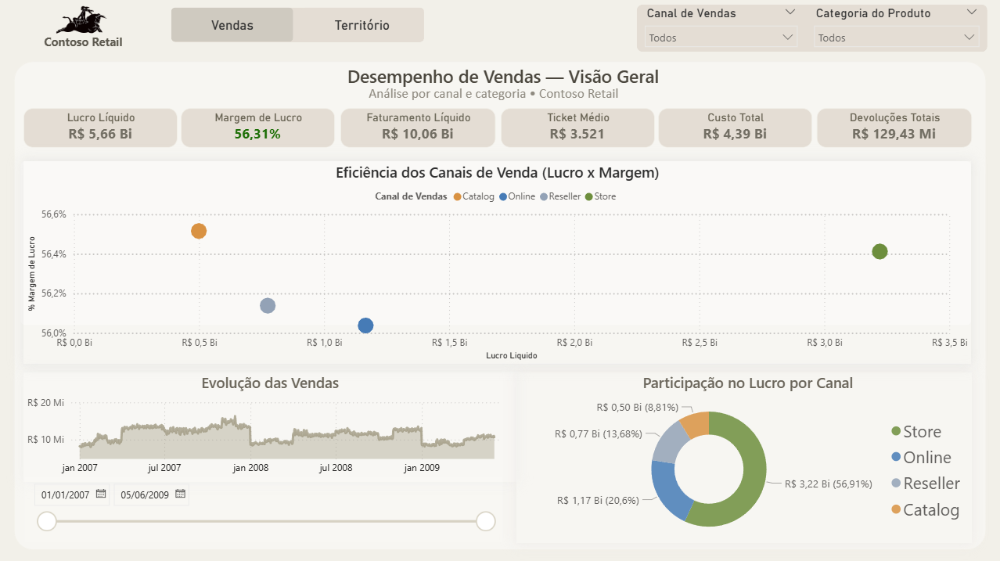
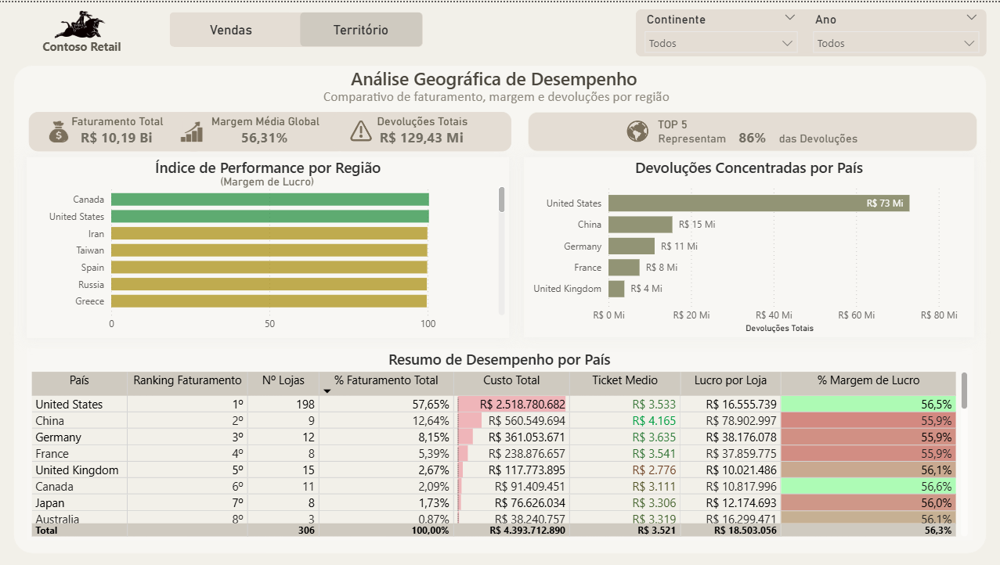

# Contoso_Retail_BI

# 📊 Contoso Retail – Business Intelligence

Projeto de Business Intelligence desenvolvido com base no dataset **Contoso Retail**, com foco em análise de vendas, território e indicadores estratégicos para tomada de decisão.

## Objetivo do Projeto
Construir um dashboard interativo no **Power BI** que permita:
- Acompanhar performance de vendas
- Analisar resultados por território
- Visualizar KPIs estratégicos
- Explorar dados de forma dinâmica e intuitiva

## Ferramentas Utilizadas
- **Power BI**
- **SQL Server** (conexão e modelagem dos dados)
- **DAX** (medidas e cálculos)
- **Git & GitHub**
- **Git LFS** (versionamento de arquivos `.pbix`)

## Principais KPIs
- Receita Total
- Quantidade de Vendas
- Ticket Médio
- Crescimento ao longo do tempo
- Comparativo entre territórios

## Visões do Dashboard

### 🔹 Visão Geral

### 🔹 Vendas por Território

## Observações
- O arquivo `.pbix` é versionado utilizando **Git LFS** devido ao tamanho.
- Projeto desenvolvido para fins de **portfólio em Data Analytics / BI**.
