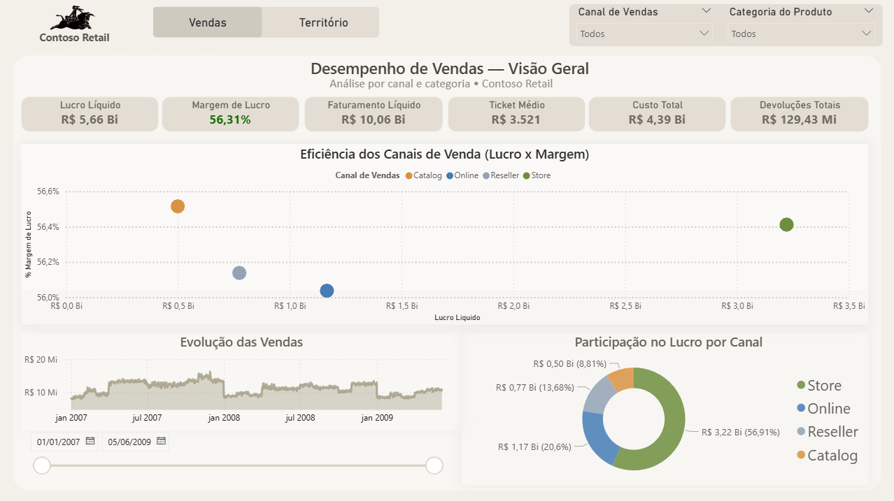
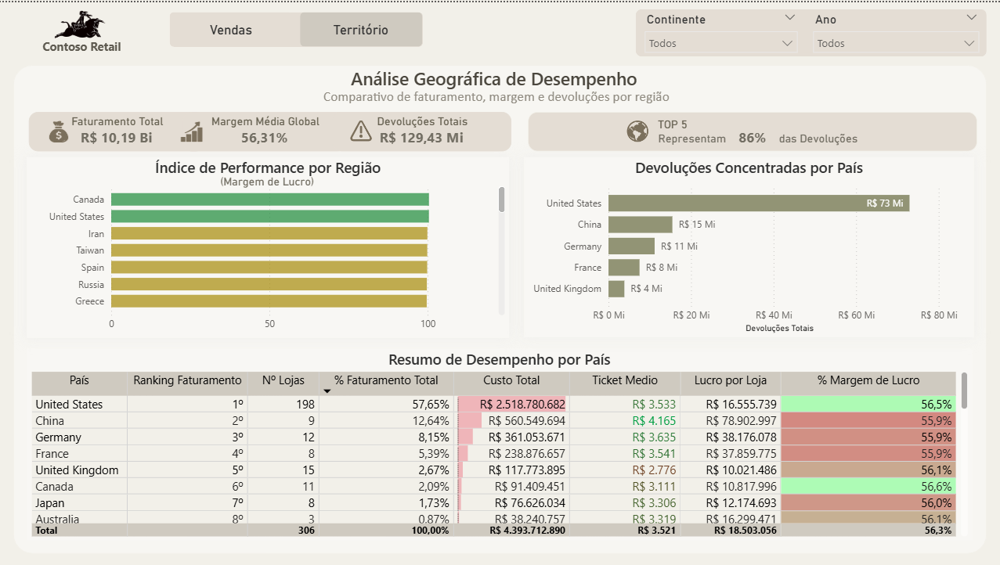

# Contoso_Retail_BI

# Contoso Retail – Business Intelligence

Projeto de Business Intelligence desenvolvido com base no dataset **Contoso Retail**, com foco em análise de vendas, canais e desempenho geográfico para suporte à tomada de decisão.

## Objetivo do Projeto

Construir um **dashboard interativo no Power BI** que permita analisar a performance do negócio sob diferentes perspectivas:

* evolução das vendas ao longo do tempo
* eficiência dos canais de venda
* desempenho por território
* indicadores financeiros estratégicos

O objetivo é permitir que gestores identifiquem **quais regiões, canais e períodos geram maior valor para o negócio**.

---

# Business Questions

O dashboard foi construído para responder perguntas estratégicas como:

### Performance de vendas

* Como as vendas evoluíram ao longo do tempo?
* Qual é o faturamento líquido e o ticket médio do negócio?
* Qual é a margem média de lucro?

### Eficiência dos canais de venda

* Qual canal gera **mais lucro**?
* Existe diferença de margem entre canais como **Store, Online, Reseller e Catalog**?
* Qual canal apresenta melhor relação entre **lucro e margem**?

### Desempenho geográfico

* Quais países ou regiões concentram maior faturamento?
* Como a margem de lucro varia entre territórios?
* Existem regiões com **alta receita mas baixa margem**?

### Devoluções

* Quais países concentram a maior parte das devoluções?
* Existe concentração de devoluções em poucos mercados?

---

# Principais KPIs

O dashboard apresenta indicadores estratégicos do negócio:

* **Faturamento Líquido**
* **Lucro Líquido**
* **Margem de Lucro**
* **Ticket Médio**
* **Custo Total**
* **Volume de Devoluções**

Esses KPIs permitem uma visão rápida da saúde financeira do negócio.

---

# Visões do Dashboard

## Visão Geral de Vendas



Principais análises disponíveis:

* evolução das vendas ao longo do tempo
* eficiência dos canais de venda (lucro x margem)
* participação de cada canal no lucro total
* comparação de desempenho entre canais

Essa visão permite entender **quais canais geram mais valor para o negócio**.

---

## Análise por Território



A análise geográfica apresenta:

* ranking de desempenho por país
* comparação de faturamento entre regiões
* margem de lucro por território
* distribuição de devoluções por país

Também inclui um **resumo consolidado por país**, com métricas como:

* número de lojas
* faturamento total
* ticket médio
* lucro por loja
* margem de lucro

Essa análise ajuda a identificar **mercados mais lucrativos e regiões com potencial de crescimento**.

---

# Ferramentas Utilizadas

* **Power BI**
* **Power Query (M)** para transformação de dados
* **DAX** para criação de métricas
* **SQL Server** para modelagem e conexão com os dados
* **Git & GitHub**
* **Git LFS** para versionamento do arquivo `.pbix`

---

# Estrutura do Projeto

```
PowerBI_Contoso_Retail
│
├── dashboard
│   └── Contoso_Retail.pbix
│
├── images
│   ├── sales_overview.png
│   └── territory_analysis.png
│
└── README.md
```

---

# Insights Possíveis

Com o dashboard é possível identificar padrões como:

* canais que concentram maior participação no lucro
* regiões com melhor desempenho financeiro
* mercados com maior volume de devoluções
* evolução das vendas ao longo do tempo

Essas análises permitem explorar o desempenho do negócio sob diferentes dimensões, apoiando decisões estratégicas.

---

## Observações
- O arquivo `.pbix` é versionado utilizando **Git LFS** devido ao tamanho.
